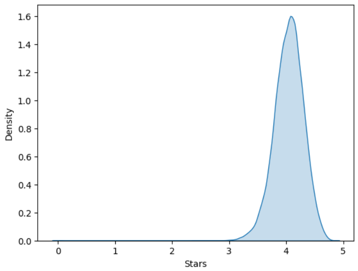

  <a href="https://github.com/AyalaTzabari">
     

 
<i>Data acquisition and analysis for predicting a research question using <a href="https://www.python.org/">Python🐍</a> & <a href="https://www.selenium.dev/documentation/webdriver/"> Selenium🔥</a>From <a href="https://www.goodreads.com/">GoodReads📚</a> </i>
  
  
## About the Project 📖

  - The purpose of the study was to check whether it is possible to predict the rating of a book after several years of its publication.
  
  - Scraping & Crawling.
  
  - Clean the data set & EDA.
  
  - Predictive models.
  
## Modles & EDA

  
  
  

  
  

 
<i>Machine Learning Algorithms <a href="https://realpython.com/knn-python/">KNN</a> & <a href="https://realpython.com/linear-regression-in-python/">linearRegression</a>&<a href="https://towardsdatascience.com/random-forest-in-python-24d0893d51c0">RandomForest🌳</a>&<a href="https://www.geeksforgeeks.org/decision-tree-implementation-python/">DecisionTree🌴</a>&<a href="https://www.activestate.com/resources/quick-reads/how-to-create-a-neural-network-in-python-with-and-without-keras/">NeuralNetwork</a>&<a href="https://machinelearningmastery.com/lasso-regression-with-python/">Lasso</a></i>
  

## In Action 🎬

  <a href="https://github.com/AyalaTzabari">
    <a href="https://youtu.be/avfzXNIbI8I">Link to the youtube video</a>
      
  </a>

